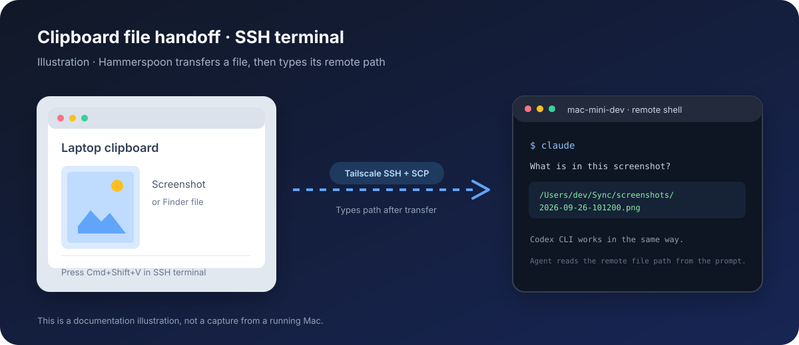

# Remote Machine

**My personal setup script for getting a remote Mac ready for development.** It installs the tools I use and walks through the machine-specific steps in a guided CLI.

I do a lot of mobile development, so the setup includes Xcode, Android tooling, simulators, and the shell helpers I use for those projects. I also build web apps and often run several app stacks in Docker at once. OrbStack is my preferred Docker runtime on macOS for its performance and low overhead when those stacks run in parallel.

My preferred agent harness is the **Codex desktop app**. For my workflow, its remote machine handling is best in class: I can work across my laptop and remote Macs, hand tasks between them, and talk through work in voice mode. I occasionally ask Codex to delegate work to Claude Code or another CLI agent as a subagent. I also use Claude Desktop sometimes, and Herdr when I want a terminal-first view of CLI agents. The setup supports all three ways of connecting to a dev box.

[](https://www.apple.com/macos/)
[](LICENSE)
[](https://www.gnu.org/software/bash/)

## Start here

On the Mac mini, run this in an interactive terminal in your provider console or an independent Screen Sharing session. Initial Tailscale SSH setup can interrupt SSH connections:

```bash
curl -fsSL https://raw.githubusercontent.com/jensvansteen/remote-machine/main/install.sh | bash
```

It fetches or updates the setup repo at `~/Projects/remote-machine` and starts the guided CLI. On a clean macOS install, the first Git command may prompt to install Apple's Command Line Tools. You need network access and an administrator account. For an existing checkout elsewhere, set `REMOTE_MACHINE_DIR` to its path before running the installer.

Already cloned it? Run `./bootstrap.sh` from the checkout. The installer and bootstrap are safe to rerun: installed tools are kept, detected, or skipped where practical.

If a phase stops, update the checkout and rerun the guided CLI. The bootstrap refreshes Homebrew, mise, and safe-chain paths between phases; you do not need to reload your login shell during the run.

For agent-assisted setup or recovery, the repo includes a [Remote Machine setup skill](.agents/skills/remote-machine-setup/SKILL.md). It guides agents to the current scripts and safety checks; the guided CLI remains the setup entry point.

At startup, the CLI asks for the machine name, Xcode/iOS and Android builds, optional clipboard file handoff, whether to install the optional SimDeck CLI (default: skip). It shows the run plan before proceeding. Long downloads run in the CLI so their prompts and progress remain visible.

## What it installs

| Area | Included |
| --- | --- |
| Everyday tools | Homebrew, OrbStack, Git, GitHub CLI, Google Chrome, Paper Design, Herdr, Watchman, and shell utilities |
| AI tools | Claude Code CLI and desktop app; Codex CLI and the ChatGPT desktop app with Codex mode |
| Language runtimes | Node, Python, Java, and Ruby managed by mise |
| Mobile builds | Optional Xcode and Android command-line SDK tools |
| Remote access | Tailscale SSH, authenticated with your Tailscale identity |
| Optional simulator control | SimDeck CLI if selected during bootstrap |
| Extra service | osquery visibility |
| Optional laptop handoff | Hammerspoon shortcut for copying files and clipboard screenshots into an SSH terminal session |

Existing installations are detected to avoid unnecessary reinstalls. Authentication, macOS privacy grants, and other human steps stay interactive.

OrbStack is installed when missing (macOS 14 or newer). Open it once after setup to complete its first-run setup. Run Docker-based app stacks on the mini itself; the setup does not copy your laptop's containers or volumes.

Paper Design is installed when missing. Open Paper once on the mini to sign in; to connect an agent, use Paper's in-app **Connect your agent** guide. See [Paper's MCP setup](https://paper.design/docs/mcp).

### Why these steps?

- **mise** installs and selects the Node, Python, Java, and Ruby versions used by projects on the mini.
- **safe-chain** wraps package installers such as npm and pip to check for known malicious packages. This setup also waits until a package release is five days old by default.
- **Remote access** uses **Tailscale SSH**: sign into your tailnet, then connect using your Tailscale identity. You do not need a Mac password or personal SSH key for SSH login. Administrator commands such as `sudo` can still ask for your Mac password.

### Tailscale SSH setup

Your **laptop keeps the normal Tailscale app**. The **remote Mac runs the open-source `tailscaled` service**, which supports Tailscale SSH on macOS. Phase 05 installs the Homebrew formula when missing, starts a service at boot when needed, prints a browser sign-in URL, and enables SSH. An existing service and its preferences are reused. Rerunning an already configured setup skips sign-in and SSH activation.

Sign into the same tailnet on both machines. Your tailnet must allow both network access to the Mac and Tailscale SSH access to the macOS account you want to use. Review the [Tailscale SSH access rules](https://tailscale.com/docs/features/tailscale-ssh#configure-tailscale-ssh) if a connection is denied. A policy using **check** may periodically request browser reauthentication; **accept** uses your existing Tailscale identity without that extra check. The setup does not edit your tailnet policy.

### If the remote Mac already has the Tailscale app

Use a provider console or Screen Sharing connection that works independently of Tailscale, and pause active remote agent work before switching. The setup stops if the GUI app is active or its state cannot be checked, rather than disconnecting your session automatically.

1. Disconnect the GUI app **on the remote Mac** and confirm your desktop session still works. Keep your laptop's app connected.
2. Run `./05-tailscale.sh` from the setup checkout. It reuses an existing background service, including one installed by an earlier setup. If Homebrew reports a cask conflict, remove that GUI cask with `brew uninstall --cask tailscale` from the independent desktop session, then rerun the phase; do not use `--zap`.
3. Open the printed login URL and sign into your tailnet. The service may appear as a new device with a different address or name; use the connection command printed by the script.
4. Test a fresh connection from the laptop, then update your saved host in Codex, Claude, Herdr, and VS Code. Leave the remote GUI app disconnected while using the service. Once these connections work, you can uninstall the remote GUI app; keep the `tailscaled` service and your laptop's Tailscale app.

If both the app and service were installed previously, keep the service for Tailscale SSH. Do not follow older instructions to uninstall it. If you need to restore a retained GUI installation, run the following on the remote Mac, then reconnect its GUI app:

```bash
sudo /opt/homebrew/bin/tailscale --socket=/var/run/tailscaled.socket down
```

macOS Remote Login is not required by Tailscale SSH; this setup leaves its current setting unchanged. [Tailscale's macOS variants](https://tailscale.com/docs/concepts/macos-variants) explain why the remote service differs from the laptop app.

## Connect your laptop

Add an SSH alias for the mini in `~/.ssh/config`. Use the service's current Tailscale DNS name or IP from the setup output or Tailscale device list:

```sshconfig
Host mac-mini-dev
  HostName mac-mini-dev
  User your-mac-username
```

Tailscale authenticates this login. Replace `your-mac-username` with an existing account on the mini, and set `HostName` to its actual Tailscale name or IP. Verify a fresh connection from your laptop:

```bash
ssh -o ControlPath=none -o PreferredAuthentications=none mac-mini-dev
```

### Codex desktop: my main workspace

On your laptop, open the ChatGPT desktop app in **Codex** mode and sign in. The bootstrap installs the Codex CLI on the mini. Once the SSH alias above works, open **Settings → Connections** in the desktop app, add or enable `mac-mini-dev` as an SSH host, and choose a project folder on the mini such as `~/Projects/my-app`. Start the task in that remote project; its files and commands live on the mini. Keep the `codex` command available in the mini's login shell, since the app starts its remote service over SSH. See OpenAI's [SSH host setup](https://learn.chatgpt.com/docs/remote-connections#connect-to-an-ssh-host).

For a specific task, I can ask Codex to run Claude Code or another agent CLI as a subagent on the machine hosting the project, then bring its findings back into the Codex task.

### Claude Desktop: occasional Code sessions

On your laptop, open Claude Desktop's **Code** tab. Before starting a session, open the environment dropdown and choose **+ Add SSH connection**. Give it a name and use the same `mac-mini-dev` SSH alias; leave the identity-file field empty for Tailscale SSH. Then select that connection and the project folder on the mini. Claude Code runs on the remote machine while the desktop app stays on your laptop. See Anthropic's [SSH sessions guide](https://code.claude.com/docs/en/desktop#ssh-sessions).

Choose the **SSH** environment for your own Mac mini; Claude Desktop's **Cloud** environment runs on Anthropic-hosted infrastructure. The bootstrap also installs Claude Code on the mini for direct CLI use.

### Herdr: occasional terminal-first sessions

Herdr is installed by default on the mini. When I want a terminal-first view of agents, I install it on the laptop too and register the mini from there:

```bash
brew install herdr
herdr machine add mac-mini-dev --label "Mac mini"
herdr
```

Herdr asks before installing or replacing its remote component. Its remote sessions and agents run on the mini; the Herdr window and clipboard live on your laptop. A saved machine appears alongside local work in Herdr, so you can switch between local and remote agents in one window. See the [Herdr guide to connecting machines](https://herdr.dev/docs/connecting-machines/) for changing labels, disabling/removing hosts, and troubleshooting.

For a single direct attachment instead of a saved machine profile, use `herdr --remote mac-mini-dev`. You can also SSH in first and run `herdr` on the mini; that is a remote terminal client and does not bridge the laptop's desktop clipboard.

### Keep project paths predictable

I use the same `~/Projects/<project-name>` layout on my laptop and each remote Mac. Clone each repository under the same folder name on every machine, and keep its default branch and setup instructions consistent. That makes SSH, editor commands, and agent handoffs easier to follow without translating paths. For example:

```text
~/Projects/
  remote-machine/
  my-app/
  another-project/
```

The setup installs into `~/Projects/remote-machine` by default. It does not copy your other projects or their uncommitted files. Clone the repositories you need on each Mac, then fetch the branch you intend to work on. Keep machine-specific credentials and `.env` files out of Git and configure them separately on each host.

### Move a Codex task between machines

In the Codex app, add your laptop and remote Mac as connected hosts, then save the same repository as a project on each host. Start a chat in the checkout or worktree where the code actually lives. To move the open chat, select its current run location in the footer, choose the Mac mini, and select **Hand off**. You can bring it back to **This computer** later.

You can also ask Codex from **another chat**: **“Move my [chat name] task to my Mac mini.”** Codex can hand off the named chat and its Git state. A chat cannot initiate its own handoff through a prompt. See OpenAI's [hand-off documentation](https://learn.chatgpt.com/docs/remote-connections#hand-off-a-chat-between-hosts).

Before moving across machines, make sure the destination has the repository, required runtime and dependencies, and any local-only configuration the task needs. Use the same project folder name on both hosts so the destination is easy to identify. Check the destination checkout and task status after the handoff; machine-local services, credentials, and ignored files do not come along automatically. You can also choose the desired host and project when starting a new Codex chat.

### VS Code Remote SSH: optional editor

Install VS Code and Microsoft's **Remote - SSH** extension on your laptop. Connect to `mac-mini-dev`, then open the project folder on the mini. Alternatively, from an SSH terminal in a project directory, run `code .`; the helper prints a clickable link that opens the folder through VS Code Remote SSH on your laptop. It uses the mini's Tailscale hostname by default; use `CODE_REMOTE_HOST=mac-mini-dev code .` if your SSH alias differs.

The VS Code editor is local, but its terminal, files, and agent commands run on the mini. Claude Code and Codex CLI run in that remote terminal. The Claude and ChatGPT desktop apps installed by this setup launch on the mini; a local desktop app on the laptop does not automatically attach to a CLI session on the mini.

## Laptop checklist

Use this checklist before, during, and after setup. It lives in the repository README, so you can follow it from your laptop while the CLI runs on the Mac.

### Before connecting

- [ ] Install VS Code and the Microsoft **Remote - SSH** extension if you want an editor on your laptop.
- [ ] Keep your provider's recovery console available for the initial setup and later recovery.
- [ ] If your terminal uses a custom terminfo entry such as Ghostty, install it on the mini before the first interactive SSH session:

  ```bash
  infocmp -x xterm-ghostty | ssh <initial-host> -- tic -x -
  ```

### While setup runs

- [ ] Open the browser sign-in URL printed by phase 05 and join the same tailnet as your laptop.
- [ ] Keep the CLI running while Xcode or Android SDK downloads run.
- [ ] Confirm your tailnet permits Tailscale SSH to your macOS account, add the SSH alias above, and verify a fresh laptop connection.

### After setup

- [ ] Confirm the mini appears online in Tailscale and `ssh mac-mini-dev` still works.
- [ ] Add the mini as an SSH host in Codex desktop and save a remote project folder.
- [ ] If you use Claude Desktop, add the mini as an SSH environment in its Code tab.
- [ ] If you use Herdr, register the mini from your laptop using the commands above.
- [ ] Clone your working repositories under the same `~/Projects/<project-name>` paths on the laptop and mini.
- [ ] Add the same repository as a Codex project on both hosts if you want to hand off chats between them.
- [ ] If you want VS Code, go to the folder you want to open in an SSH shell on the mini, run `code .`, and click the link it prints to open that folder through VS Code Remote SSH on your laptop.
- [ ] Sign in to Claude Code and Codex on the mini when you first use their CLIs. Open the Claude and ChatGPT desktop apps on the mini once if you want their desktop sign-in flows.
- [ ] If you want laptop-to-mini file handoff, install Hammerspoon on the laptop, configure the hotkey using [FILE-HANDOFF.md](FILE-HANDOFF.md), and grant it Accessibility permission.
- [ ] If you want remote simulator control, select SimDeck during bootstrap and follow the pairing steps below.

## Clipboard file handoff from an SSH terminal

This optional Hammerspoon shortcut is for an **interactive terminal session connected to the mini over SSH**, including remote Codex CLI and Claude Code CLI sessions. It is not a clipboard integration for the Codex or Claude desktop apps.

Copy a Finder file or capture a screenshot to the laptop clipboard, focus the SSH terminal (with the agent CLI running there if you want it to inspect the file), and press **Cmd+Shift+V**. Hammerspoon transfers the file to the mini over the existing SSH alias, then types its remote path into the terminal. The CLI can use that path to inspect the file. Your normal **Cmd+V** clipboard remains unchanged.



Run `./16-clipboard-handoff.sh` on the mini to prepare its private drop folder. On the laptop, install Hammerspoon and follow [the setup guide](FILE-HANDOFF.md). The guide checks for an existing Hammerspoon install before suggesting Homebrew.

Herdr's `herdr --remote mac-mini-dev` is a different workflow: the Herdr client runs on the laptop and bridges image clipboard paste into its remote session. The Hammerspoon shortcut is useful for ordinary SSH terminals where that client-side bridge is not in use.

## Remote simulator control

SimDeck is the optional simulator-control tool included in this personal setup. It can control iOS simulators and Android emulators through a CLI and browser interface. The CLI is installed only if you select it during bootstrap.

On the mini, start the simulator service and display its pairing instructions:

```bash
simdeck pair
```

Open the printed pairing link or scan its QR code from a device connected to your Tailscale network. SimDeck supports iOS simulators and Android emulators. See the [SimDeck repository](https://github.com/NativeScript/SimDeck) for CLI commands and IDE integrations. Keep simulator access on Tailscale; do not expose the service publicly.

## Handy CLI options

```bash
./bootstrap.sh --help
./bootstrap.sh --skip-xcode
./bootstrap.sh --skip-android
./bootstrap.sh --clipboard-handoff
./bootstrap.sh --resume-from 06
```

Open Chrome from a shell with `open -a "Google Chrome"`. The worktree helpers `wt` and `wt-pr` switch into the created worktree; add `-a claude` or `-a codex` to launch the agent CLI there.

## Safety notes

- Tailscale authentication, Apple ID sign-in for Xcode, and Git identity require interactive input. Git authentication and commit signing remain user-managed.
- Configure GitHub authentication directly on the mini with `gh auth login` when needed.
- Keep a provider console or independent desktop session available when switching Tailscale variants. Existing SSH sessions may disconnect during the switch.
- The scripts disable sleep and are intended for a dedicated Mac mini. Review before using on a machine with another purpose.

## Repository map

| Files | Purpose |
| --- | --- |
| `install.sh`, `bootstrap.sh` | One-line entry point and guided CLI |
| `01-07` | Prerequisites, Homebrew, macOS, runtimes, Tailscale, package protection, agent tools |
| `08-09` | Xcode and Android SDK |
| `10-11` | Git identity and osquery |
| `14`, `shell-helpers.sh` | Shell prompt and direct CLI helpers |
| `16-clipboard-handoff.sh`, `FILE-HANDOFF.md`, `hammerspoon-init.lua` | Optional laptop-to-mini SCP handoff |
| `Brewfile`, `mise.toml` | Declarative packages and runtime versions |
| `.agents/skills/remote-machine-setup/`, `.claude/skills/` | Shared setup skill for Codex and Claude Code |

Licensed under the [MIT License](LICENSE).
